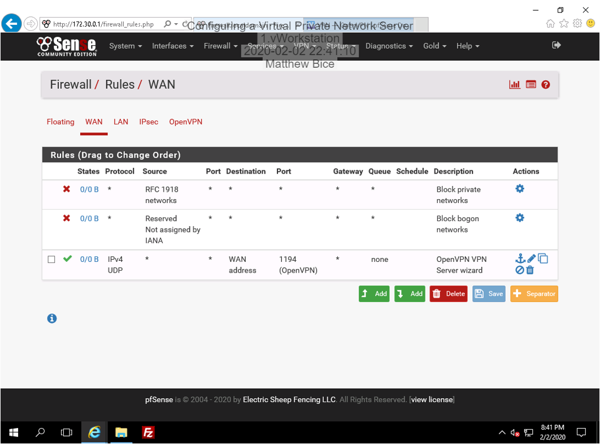

# Introduction

This lab is dedicated to exploring and configuring a Virtual Private Network or VPN. This lab will not only show the basic ins and outs of a VPN, but also how to properly configure one with the necessary security knowledge needed to make one that is secure and difficult to penetrate. Once this is done, the other side of the VPN will be configured for secure file transfers.

# Hands-On Demonstration

## Configuring IPsec with a pfSense Firewall

### Create a new certificate authority

In this step, I created a new certificate authority which is used to issue digital certificates that authorize the ownership identity credentials and public keys. This new certificate authority is configured to match my current location and is registered under the name IPsecVPN. The following screenshot shows the newly created certificate authority appearing in the certificate authorities table.

  

### Create a server certificate

After creating the certificate authority, I then made a server certificate which will be used for identifying a server. This server certificate utilizes an Internet Key Exchange v2 (IKEv2) protocol that uses NAT transversal. Most of the data is identical to that which is stored in the certificate authority. The certificate also uses the IP address 172.30.0.1. The screenshot below shows the creation of this new server certificate which is found below the self-signed default certificate.

  

### Enable the IPsec Mobile Client Support

This stretch of the lab focuses on enabling IPsec Mobile Client Support. In doing so, the IPsec tunnel configuration is changed (then applied) and a phase one definition for IPsec Mobile Clients is needed. The phase one definition for the VPN tunnel is created with the IKEv2 key exchange version and EAP-MSChapv2 (Extensible Authentication Protocol-Microsoft Challenge Handshake version 2) authentication method. From there, the distinguished name is set to match the certificate’s IP address and the peer identifier setting is changed to allow connections from any potential matching client. The certificate is then set to match the server certificate and the encryption settings are configured. The screenshot shows the IPsec Tunnels table with the new reconfigured tunnel.

  

### Create a phase two definition for the VPN

This section of the lab consisted of making a phase 2 definition for the VPN tunnel. One thing to notice here is that the Local Network setting is configured to a Network with the IP address 0.0.0.0. This will cause all Internet traffic to flow through the VPN tunnel (as opposed to a split tunnel configuration) in order to maximize security. The hash algorithm SHA1 is also selected to allow for backwards compatibility.

The next part of this section is configuring a pre-shared key for the VPN. A new key with my name and EAP (Extensible Authentication Protocol) is created. The screenshot presents the Pre-Shared Keys table with the newly created key.

  

## Configuring a Firewall Rule for VPN Traffic

### Configuring firewall rules

Now that the VPN tunnel has been configured, next a firewall rule must be added for the VPN’s traffic. A new firewall rule is created with an IPsec interface (which packets will match and pass through the firewall) and the ability to let any protocol through the firewall. The rule is then named IPsec Open and the screenshot shows the resulting creation in the IPsec Rules table.

  

# Applied Learning

## Configure OpenVPN with pfSense Firewall

### Configure an open VPN server

This section begins with the creation of a new certificate authority that is configured with my name and information. It uses a key length of 2048 bits and has a lifetime of 3650 days. The screenshot below shows the certificate authority with this information prior to its creation.

  

### Continue the wizard setup

After the certificate authority is created, a likewise server certificate is then made. The server setup for the VPN is then configured. The VPN will not authenticate TLS packets, follow most default values, will not redirect gateways, has two simultaneous users, allows client-server communication, and has the endpoint 172.30.0.0/24. In advanced settings, the VPN is also configured to predefine a route for directing all connections to the LAN network. The screenshot shows the Client Settings section of the setup page.

  

## Configuring a Firewall Rule for VPN Traffic

### Configure a firewall rule to allow userse the ability to connect with the VPN

In this brief section, the firewall rules are configured to enable the Firewall Rule and OpenVPN rule in order to allow traffic through the firewall. The screenshot shows the completed OpenVPN configuration.

  

### View the new OpenVPN firewall rule

This section merely shows that the OpenVPN rule appears on the WAN Rules table.

  

### Show the OpenVPN rule on the OpenVPN rules table

Similarly, this section only proves that the newly created OpenVPN appears on the OpenVPN Rules table.

  

# Lab Challenge and Analysis

## Analysis and Discussion

One of the biggest reasons a VPN is not 100% secure is because there is clearly a compromise to be made between security and performance. Heftier encryption keys are more secure but take longer to load and can significantly slow a system down. Moreover, in this case, all Internet traffic is set to flow through the VPN tunnel as opposed to a split tunnel configuration. The split tunnel configuration is used in order to speed up the flow of information. When all traffic is routed through the VPN tunnel, information is more secure but moves slower as a result. Finally, VPNs cannot be entirely secure because of the way some hackers attack. If a certain computer is set to have access to an encrypted website, all the hacker needs to do is gain access to that computer. With these reasons in mind, a VPN is far from perfect protection.

## Tools and Commands

The pre-shared key for the IPsec VPN has been changed from password1 to VPNp@sswo0rd.

  

## Challenge Exercise

The following screenshot shows the MatthewBice_CA certificate successfully copied onto TargetWindows02 and stored in the Trusted Root Certificate Authorities store.

  

